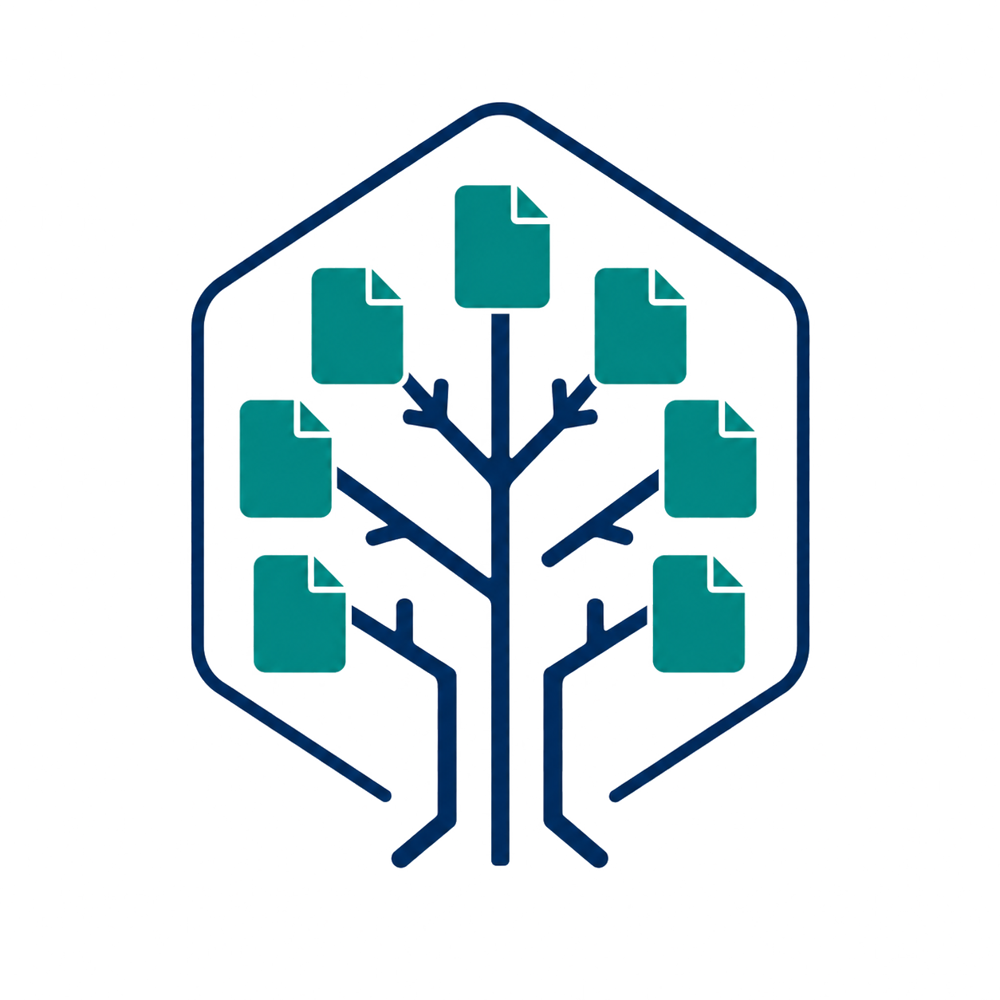

# RAGTree

<div align="center">
  

  <h3>Bring-your-own-stack Semantic RAG framework</h3>

  <p>
    Build, evaluate, and integrate grounded RAG pipelines over complex documents.
  </p>

  <p>
    
    
    
    
  </p>
</div>

---

## Overview

**RAGTree** is a bring-your-own-stack framework for Semantic RAG pipelines.

The project is built around a simple rule:

> The core defines contracts. Integrations implement contracts. Tests verify contracts.

RAGTree started as a research workbench for relation extraction, ontology-guided retrieval, KG-RAG, agentic RAG, evaluation, runtime analysis and CO2 estimation. It is now an installable library with a `src/` layout, a dependency-light core of stable schemas and protocols, layered tests, and optional addons — while all research experiments remain runnable.

Users bring their own:

- LLM provider;
- embedding model;
- vector database;
- retriever;
- ontology or knowledge graph;
- evaluator;
- exporter;
- API or UI layer.

## What works today

```bash
pip install -e .        # lightweight core: schemas, protocols, config, registry, CLI
ragtree doctor          # check the install and see which optional extras are present
pytest tests/unit tests/contract
```

The core contracts are importable with zero optional dependencies:

```python
from ragtree import Document, Chunk, RAGTask, RAGResult, require_extra
from ragtree.core.protocols import LLMProvider, VectorStore, Retriever

# Any object with the right methods satisfies a protocol — no inheritance needed.
class MyProvider:
    def complete(self, messages: list[dict[str, str]], **kwargs) -> str:
        return "your stack answers here"

assert isinstance(MyProvider(), LLMProvider)
```

Adapter authors validate implementations against the shared contract suite in
`tests/contract/bases.py`; the in-memory reference implementations in
`tests/contract/fakes.py` show the minimum an adapter must do.

## Repository layout

```text
RAGTree/
├── src/ragtree/
│   ├── core/                  # schemas, protocols, config, registry, errors  ← stable
│   ├── cli/                   # lightweight CLI (doctor, addons, version)
│   ├── datasets/              # dataset loaders (research layer)
│   ├── evaluation/            # relation metrics (research layer)
│   ├── kg/                    # KG stores and retrievers (research layer)
│   ├── ontologies/            # ontology loading, linking, retrieval (research layer)
│   ├── preprocessing/         # dataset converters (research layer)
│   ├── processing/            # RAG strategies and orchestrators (research layer)
│   ├── services/              # LLM clients: ollama, openrouter, vllm, mock
│   └── vendor/                # vendored third-party graph code
├── tests/
│   ├── unit/                  # pure core logic (no extras)
│   ├── contract/              # protocol conformance bases + fakes
│   ├── integration/           # real optional stacks (arrives with adapters)
│   ├── e2e/                   # tiny full pipelines (arrives with the task layer)
│   ├── regression/            # protects experiment output formats
│   └── fixtures/              # tiny committed datasets
├── experiments/               # research notebooks and benchmark data
├── scripts/                   # current benchmark entry points (preserved)
├── examples/                  # example configs
├── configs/                   # research configuration
└── docs/                      # architecture, design, sprint plan
```

The research layers are ported behind the core protocols sprint by sprint
(`docs/sprint-plan.md`); `tasks/`, `retrieval/`, `integrations/` and `apps/`
join the tree in sprint 2–3.

## Core protocol rule

Core modules never import optional integration SDKs. This is enforced by a
unit test (`tests/unit/test_optional_import_guard.py`), not just by convention.

The core defines protocols (see `src/ragtree/core/protocols.py`):

```python
from typing import Any, Protocol

class LLMProvider(Protocol):
    def complete(self, messages: list[dict[str, str]], **kwargs: Any) -> str: ...

class VectorStore(Protocol):
    def add_chunks(self, chunks: list[Chunk], embeddings: list[list[float]] | None = None) -> None: ...
    def search(self, query: str, top_k: int = 5, **filters: Any) -> list[EvidenceSpan]: ...
```

Missing optional dependencies raise a helpful error instead of an import crash:

```python
from ragtree import require_extra

require_extra("chromadb", "vector-chroma")
# MissingDependencyError: This feature requires the 'vector-chroma' extra.
# Install it with: pip install 'ragtree[vector-chroma]'
```

## Installation

Lightweight install (schemas, protocols, config, registry, CLI):

```bash
pip install -e .
```

Development install:

```bash
pip install -e ".[dev]"
```

Optional addons, by category (names match `pyproject.toml`):

| Extra | Purpose |
|---|---|
| `llm-openai`, `llm-ollama`, `llm-litellm` | LLM provider clients. |
| `embeddings` | sentence-transformers embedding backend. |
| `vector-faiss`, `vector-chroma`, `vector-qdrant`, `vector-elastic` | Vector stores. |
| `graph`, `neo4j` | Graph processing and Neo4j store/export. |
| `rdf` | RDF / OWL ontology support (rdflib, owlready2). |
| `api`, `ui` | FastAPI service and Streamlit workbench surfaces. |
| `notebooks`, `docs`, `ops`, `dev` | Tooling. |
| `all` | Everything, for a full local showcase. |

```bash
pip install -e ".[llm-litellm,vector-chroma,neo4j]"
```

`ragtree addons` prints this table with live install status.

## Testing

| Test folder | Runs by default | Purpose |
|---|---:|---|
| `tests/unit/` | Yes | Pure logic: schemas, config, registry, errors, CLI, import guard. |
| `tests/contract/` | Yes | Protocol conformance; reusable bases for every future adapter. |
| `tests/integration/` | No (markers) | Real optional integrations (Chroma, Qdrant, Neo4j, FastAPI, ...). |
| `tests/e2e/` | Selected | Tiny full pipeline runs with fixture data and a mock LLM. |
| `tests/regression/` | Yes | Protects `pred_relations` and current experiment output formats. |
| `tests/fixtures/` | Data only | Tiny committed datasets (exempt from the repo `*.json`/`*.jsonl` ignore). |

```bash
pytest tests/unit tests/contract        # fast, no extras required
```

## Current experiment compatibility

The research workbench is preserved, not rewritten. Scripts under `scripts/`
keep working; benchmark results live on the `xquality` branch and are never
modified. Migration targets:

| Current family | Migration target |
|---|---|
| Single-pass LLM / ICL / CoT baselines | `RelationExtractionTask` methods. |
| GrOWL-RAG, OG-RAG, Chunk-O-RAG | Ontology-guided retrieval behind `Retriever`. |
| KG-RAG, Triple KG-RAG, Community KG-RAG | KG-guided retrieval behind `Retriever`. |
| Agentic hybrid, LangGraph agents, MARAG | Agent integrations. |
| Relation evaluation | `evaluation/` + regression tests. |
| Runtime / CO2 scripts | Supplementary benchmark artifacts. |

Compatibility contracts: dataset keys stay stable, `pred_relations` outputs
stay readable, evaluation accepts old outputs and new `RAGResult` exports.

## Roadmap

Three sprints, one branch each (details in `docs/sprint-plan.md`):

| Sprint | Branch | Goal | Status |
|---|---|---|---|
| 1 | `sprint-1/installable-core` | src/ layout, core schemas + protocols, errors, test skeleton, CI. | ✅ done |
| 2 | `sprint-2/*` | Task layer, adapters ported from existing code, tiny-dataset e2e harness. | planned |
| 3 | `sprint-3/*` | FastAPI/Streamlit surfaces, Docker profiles, experiment wrappers, `v0.1.0-alpha`. | planned |

## Design rule summary

```text
core defines protocols
integrations implement protocols
tests verify protocols
examples demonstrate protocols
experiments preserve benchmark protocols
```

Full architecture rationale: `docs/DESIGN.md` and the BYOS design document.

## License

MIT.
