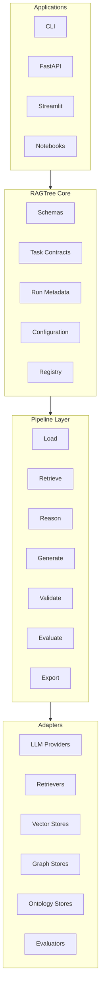

# Architecture

RAGTree should be organized as a layered Semantic RAG framework.



## Design principles

1. **Core before providers**
   The core should define interfaces and schemas. Provider-specific code should live in adapters.

2. **Task before method**
   A task defines what needs to be solved. A method defines how it is solved.

3. **Evidence before answer**
   Every meaningful RAG output should contain provenance.

4. **Configuration before hidden defaults**
   Benchmark results must be reproducible from a saved configuration.

5. **Compatibility before cleanup**
   Existing relation extraction experiments must remain runnable while the professional API is introduced.

## Proposed package structure

```text
ragtree/
  core/
    schemas.py              # Document, Chunk, Evidence, Prediction, EvaluationResult
    tasks.py                # BaseTask, TaskInput, TaskOutput
    interfaces.py           # LLMProvider, Retriever, Evaluator, Exporter
    config.py               # typed configuration
    runs.py                 # RunMetadata and artifact tracking
    registry.py             # method and adapter registration

  adapters/
    llms/                   # Ollama, vLLM, OpenRouter, LiteLLM, mock
    vectorstores/           # in-memory, Chroma, Qdrant, FAISS
    graphstores/            # local graph, Neo4j, RDF graph
    ontologies/             # RDFLib / TTL-backed ontology access

  retrievers/
    dense.py
    sparse.py
    hybrid.py
    ontology.py
    kg.py
    community.py

  tasks/
    question_answering.py
    relation_extraction.py
    claim_verification.py
    summarization.py
    ontology_linking.py
    graph_construction.py

  pipelines/
    semantic_rag.py
    relation_extraction.py
    evaluation.py

  experiments/
    relation_extraction/    # wrappers around current benchmark scripts
    runtime_co2/

  evaluation/
    metrics.py
    relation_metrics.py
    faithfulness.py
    reports.py

  exporters/
    jsonl.py
    csv.py
    graph.py

  cli/
    main.py
```

## Compatibility layer

The current codebase already contains working modules under `processing/rag/strategies`, `kg`, `ontologies`, `evaluation/relations`, and `scripts`. The professional redesign should not delete them immediately.

Instead, introduce wrappers:

| Current location | Professional wrapper |
|---|---|
| `scripts/run_single_llm_baseline.py` | `ragtree experiments relation run --method single_llm` |
| `scripts/run_icl_baseline.py` | `ragtree experiments relation run --method icl` |
| `scripts/run_cot_baseline.py` | `ragtree experiments relation run --method cot` |
| `scripts/run_growlrag_relations.py` | `ragtree experiments relation run --method growlrag` |
| `scripts/run_kg_rag_relations.py` | `ragtree experiments relation run --method kg_rag` |
| `scripts/run_marag_relations.py` | `ragtree experiments relation run --method marag` |
| `scripts/eval_relations.py` | `ragtree evaluate relation` |

This makes the repository look professional without breaking existing workflows.

## Public API target

```python
from ragtree import RAGTree
from ragtree.tasks import RelationExtractionTask

pipeline = RAGTree.from_config("examples/configs/relation_extraction.yaml")

result = pipeline.run(
    task=RelationExtractionTask(
        relation_schema=["CAUSES", "PREVENTS", "TREATS"],
        require_evidence=True,
    ),
    documents=documents,
)
```

## CLI target

```bash
ragtree demo semantic-rag
ragtree run examples/configs/qa.yaml
ragtree experiments relation run --dataset-key maven_ere --method growlrag --backend vllm
ragtree evaluate relation --gold data/preprocessed/maven_ere.jsonl --pred outputs/predictions.jsonl
```
